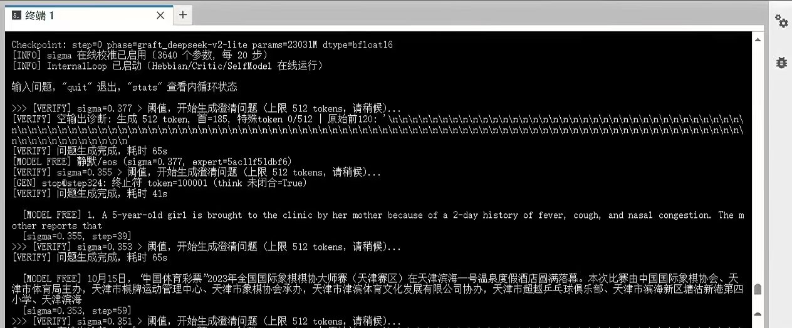

# NeuroStream-Reflex × DeepSeek-V2-Lite-Chat（嫁接实现）

NeuroStream-Reflex 双循环框架（内循环意识 / 主动求证 / 边缘混沌 / 部署即学习）
嫁接在 DeepSeek-V2-Lite-Chat 之上的代码包。权重零训练复用（1:1 直拷），
全部能力增量来自 Reflex 双循环与无监督学习机制。

## 模型与 Tokenizer（下载）

权重与分词器在魔搭社区（本仓库**不含**模型文件）：

- **下载地址**：https://modelscope.cn/models/Marshauv/Neurostream_reflex_deepseek_chat
- 文件：`reflex_dsv2lite_graft.pt`（46GB bf16，23.03B 参数 = 15.7B DeepSeek 主干 1:1 直拷 + ~7.3B Reflex 附加件）、`tokenizer.json`、`tokenizer_config.json`

```bash
# 下载模型（魔搭）
modelscope download --model Marshauv/Neurostream_reflex_deepseek_chat \
    --local_dir /root/autodl-tmp/models/Neurostream_reflex_deepseek_chat
```

## 快速开始

```bash
pip install torch transformers safetensors tqdm modelscope
bash run_chat.sh
# 常用附加参数:
#   --verify-threshold 0.3   主动求证触发阈值（σ 校准后建议 0.3）
#   --online-ce              打开每轮 CE 在线训练
#   --hebbian-lr 0           关闭 Hebbian（对照/回炉）
```

手动运行：

```bash
python run_mini.py --checkpoint reflex_dsv2lite_graft.pt \
    --tokenizer <模型目录> --device cuda --dtype bfloat16 \
    --no-online-ce --hide-think --gen-debug --sigma-cal
```

## 项目核心理念

NeuroStream-Reflex 把"意识"当作可实现的工程循环，而非哲学隐喻。五支柱：

1. **双循环（P2）**：同一自指循环运行在两个尺度——外循环（对话/行为）与内循环（自我表征/自省），共享同一套状态机制（h_state + 记忆 KV + 语义槽）；
2. **内循环意识（P1）**：SelfModel（GRU+VAE）持续编码"我如何理解当前世界"，自洽损失（loss_int）是内循环"存在感"的度量——它只与自己对话；
3. **主动求证（P3）**：每个专家带不确定性头（sigma），经 `--sigma-cal` 校准到真实不确定度；sigma 超过阈值时模型**主动询问**——不是被问才答，而是"不懂就问"；
4. **边缘混沌（P4）**：KL 惊奇有界、噪声/更新量受限、Hebbian 激活门控——在稳定与创新之间维持可调整的张力；
5. **部署即学习（P5）**：无监督 Hebbian 就地更新 + 记忆固化 + 学习率光谱（稳定/中间/可塑专家分层，本实现 16×1e-5 / 32×1e-4 / 16×8e-2），模型边用边学、不中断服务。

其中 **P1 与 P3 的因果问题是本项目最核心的实验命题：内在状态能否自发驱动语言表达？**

## 运行表现（实测）

### 无输入时的主动输出（`[MODEL FREE]`）

系统静止（无任何对话）时内循环持续运行；sigma 超过阈值即触发模型
**自由联想**——模型会主动说话，不需要用户输入：



零基线数据（观测版，12 次样本）：
- **换行流 ≈58%**（token 185=`\n` 无限重复——先验的"沉默喘气"）；
- **语料回声 ≈42%**（财经/医学/体育新闻——训练语料高频文本）；
- **真静默（eos@0）= 0%**：模型无上下文也从不"停口"，每次都刷满上限。

**结论：语言层有无条件的发声倾向，但（此刻）无内在指向**——
内循环状态与输出内容零相关（σ 恒 0.35-0.38）。这直接定义了下一个
架构课题：**内在源直通**（把内循环状态训练为解码分布的显式条件）。

### 对话中的主动涌现（`[MODEL SAYS]`）

用户输入后，模型从对话尾部**无缝续写**；sigma 高时续写中出现疑问/
不确定的表达——这就是"它想问的"。随后你的回答经反馈路径训练困惑专家
（focal boost）→ sigma 回落、疑问消解（P3 闭环）。

### 内循环自我嘀咕（`stats` 可观测）

| 指标 | 含义 | 健康区间（实测） |
|---|---|---|
| `loss_int` | 内循环自洽损失 | 0.2-0.4 有界振荡 |
| `sigma` | 不确定度（cal 后 ≈ tanh(loss_int)） | 对话中 0.15-0.4，> 阈值触发主动求证 |
| `hebbian_drift` | 专家权重就地学习量 | 缓慢单调（LR 光谱分层生效） |
| `global_drift` | Reflex 附加件漂移 | 有界（10^-2 量级） |
| `h_to_bias` | 状态门控生效度 | 初始 0（零初始化，随内循环演化） |

## 架构说明

- 主干：DeepSeek-V2-Lite-Chat（27 层 MLA：1 dense + 26 MoE；64 路由专家 top-6 + 合并共享专家 1:1 直拷；YaRN rope）——权重零训练复用
- Reflex 附加件（~7.3B）：每专家 query_proj + uncertainty_head（sigma）、SelfModel（GRU+VAE）、AttnRes、MemoryBank、Critic
- 学习率光谱（仅影响 Hebbian）：路由 16×1e-5 / 32×1e-4 / 16×8e-2，共享 1e-4，dense 1e-5（run_mini 强制覆盖 checkpoint 旧值，`--hebbian-lr 0` 一键关闭）
- 数值一致性：fp32 下与 transformers built-in 逐位一致（max|Δ|=6e-8、top-1 100%）；bf16 27 层 ≈78%（MoE 路由浮点内核噪声）
- 主动求证（P3）：σ>阈值 → 模型从对话尾部续写涌现（`[MODEL SAYS]`）/ 无对话自由联想（`[MODEL FREE]` 观测模式）

## 目录

| 路径 | 说明 |
|---|---|
| `run_chat.sh` | 一键运行入口（下载/生成 checkpoint → 双循环对话） |
| `run_mini.py` | 完整部署入口 |
| `config/ core/ loop/ interaction/ learn/ improve/` | 反射框架运行模块（`improve/` 仅架构自修改；自博弈训练未发布） |
| `scripts/` | 嫁接 checkpoint 生成 / 数值验证 / 冒烟测试 / Chat 切换 |
| `assets/` | README 展示素材（运行截图） |

## 许可

项目代码：MIT；主干权重：DeepSeek-V2-Lite-Chat（MIT，deepseek-ai/DeepSeek-V2-Lite-Chat）——衍生权重保留 MIT，使用需遵守上游条款。
